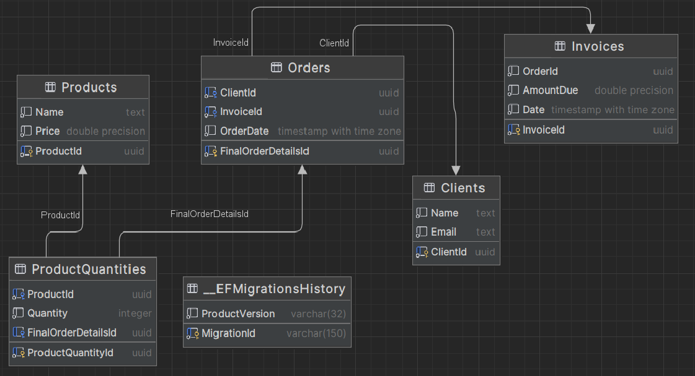

# Data Integration and Validation System
<p>The Data Integration and Validation System (DIVS) is a robust solution designed to automatically load, validate, and integrate data from two distinct sources. After the validation and integration processes, the system saves the consolidated data into a separate database and exports it into XML format. The project encompasses three databases: one for storing basic customer and product information, the second for transactional data like orders and invoices, and the third for the integrated data ready for XML report generation.</p>

# Functional Requirements
<ul>
  <li>Load JSON files containing customer and product data.</li>
  <li>Load JSON files containing order and invoice data.</li>
  <li>Ensure each customer, product, order, and invoice has a unique ID attribute; reject and report any entities with duplicate IDs.</li>
  <li>Verify the existence of a product, customer, and invoice for each order based on their ID attributes; reject any orders lacking these.</li>
  <li>Validate that the invoice amount for each order matches the total value of products purchased; reject any orders where this condition is not met.</li>
  <li>Generate XML reports from the integrated data.</li>
</ul>

# Technical Architecture
<ul>
  <li><strong>.NET:</strong> For data loading, validation, and XML report generation.</li>
  <li><strong>PostgreSQL:</strong> For data storage.</li>
  <li><strong>Entity Framework:</strong> To facilitate communication between the .NET application and the PostgreSQL database.</li>
  <li><strong>ChatGPT:</strong> For generating example data sets (customers, products, orders, invoices).</li>
</ul>

# Usage
```
dotnet run
Usage:
  [command] [options]                                                                                                   
                                                                                                                        
Commands:                                                                                                               
  -DeleteAllData                                     Clears all data from the application. Use with caution.            
  -AddData                                           Adds data to the application from specified files.                 
  -GenerateXML [outputXmlFile] [outputErrorFile]     Generates an XML file with the current data.                       
                                                                                                                        
Options for -AddData:                                                                                                   
  -Products&Clients [productFile] [clientFile]    Adds products and clients to the application from the specified files.
  -Orders&Invoices [orderFile] [invoiceFile]      Adds orders and invoices to the application from the specified files. 
```


# Final Database Diagram


# Example Data
<h2>Clients</h2>

```
{
        "ClientId": "6db88b1e-011d-431a-aab7-7844f0cb6e54",
        "Name": "Mr. Michael Peterson",
        "Email": "hammondandrew@gmail.com"
}
```

<h2>Products</h2>

```
{
        "ProductId": "27e541f9-b09e-44df-af22-125986a27d03",
        "Name": "Hard Drive 512GB",
        "Price": 75.85
}
```

<h2>Orders</h2>

```
{
        "OrderId": "03d2866d-2b3a-4a76-b0a5-4fa195929d2d",
        "ClientId": "6db88b1e-011d-431a-aab7-7844f0cb6e54",
        "OrderDate": "2024-04-14T01:23:31Z",
        "Products": [
            "27e541f9-b09e-44df-af22-125986a27d03",
            "8e30a4ca-ec0d-41b0-939c-20944d8e61df",
            "8e30a4ca-ec0d-41b0-939c-20944d8e61df",
            "8e30a4ca-ec0d-41b0-939c-20944d8e61df",
            "2988659d-86a0-4f32-82ec-25b905a3e708"
        ]
}
```

<h2>Invoices</h2>

```
{
        "InvoiceId": "8f561a00-2e27-48e0-912f-75f7781d5878",
        "OrderId": "03d2866d-2b3a-4a76-b0a5-4fa195929d2d",
        "AmountDue": 1493.85,
        "Date": "2024-04-14T06:34:51Z"
}
```

# Output XML File
```xml
<Orders>
  <Order Id="1a6b5d67-3f90-46da-b46e-2c5db133abdd" Date="2024-04-14">
      <Client Name="Mr. Michael Peterson" Email="hammondandrew@gmail.com" />
      <Products>
        <Product Id="27e541f9-b09e-44df-af22-125986a27d03" Name="Hard Drive 512GB" Price="75,85" Quantity="1" />
        <Product Id="8e30a4ca-ec0d-41b0-939c-20944d8e61df" Name="Keyboard" Price="311,01" Quantity="3" />
        <Product Id="2988659d-86a0-4f32-82ec-25b905a3e708" Name="Motherboard" Price="484,97" Quantity="1" />
      </Products>
      <Total>1493,85</Total>
  </Order>
  <!-- Repeat the structure for each order -->
</Orders>
```
# Example Error File
<p>File was generated using incorrect data</p>

```
Order with id 196e1044-be24-4b71-9a65-7815f65b2b19 is connected with the not existing user. Skipped this order.
The price in order with id: 5486bf54-d76e-41b4-ad35-ee546c02bc96 is not equal to the price on invoice attached to this order. Skipped this order
Order with id d25d85cf-ac70-46cd-84d5-e382daa67a19 is connected with the not existing user. Skipped this order.
Order with id dfc934da-f583-4303-b592-ce07dfea076a is connected with the not existing user. Skipped this order.
```

